# zmk firmware for mlego

- mlego m66 5x14 rev4

  - keymap summary

  - features rp2040(pro micro footprint) or nice!nano and compatible bt
    - [x] matrix
    - [x] encoder
    - [x] mipi sharp screen (nice!view like various sizes)
    - [x] eink, 2.13inch we act.
    - [ ] led indicators
    - [x] unicode via zmk-helpers
    - [ ] rgb per key...
  - keymap expanded per layer

- mlego m65 5x13 rev4

  - features stm32f401
    - [x] matrix
    - [x] encoders
    - [x] oled
    - [x] led indicators
    - [ ] unicode
    - [x] rgblight, strip

- mlego m4 2x2

  - features seed xiao ble nrf52840
    - [x] matrix
    - [x] encoders
    - [x] oled
    - [x] led indicators
    - [ ] unicode
    - [ ] rgblight, strip

- mlego m65 5x13 rev7

  - features xiao seeduino rp2040
    - [x] matrix
    - [x] encoders
    - [x] led indicators
    - [ ] unicode
    - [ ] rgblight

- mlego m65 5x13 rev8

  - features xiao seeduino nrf52840
    - [x] matrix
    - [x] encoders
    - [x] led indicators
    - [x] unicode

